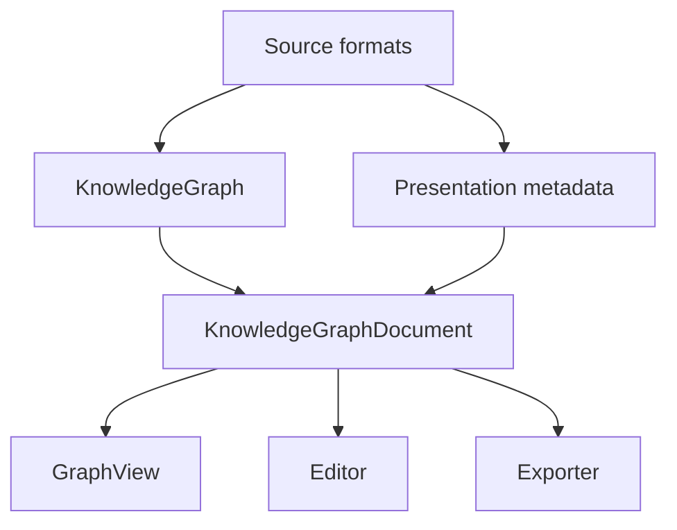
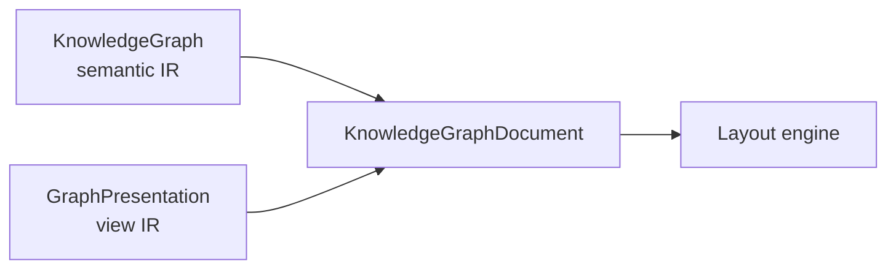
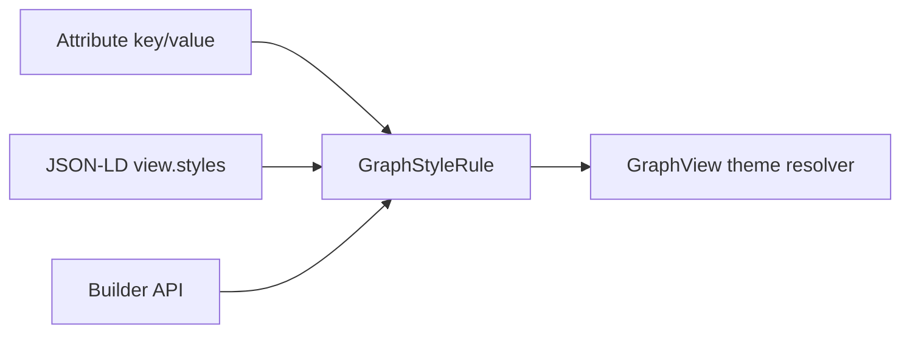
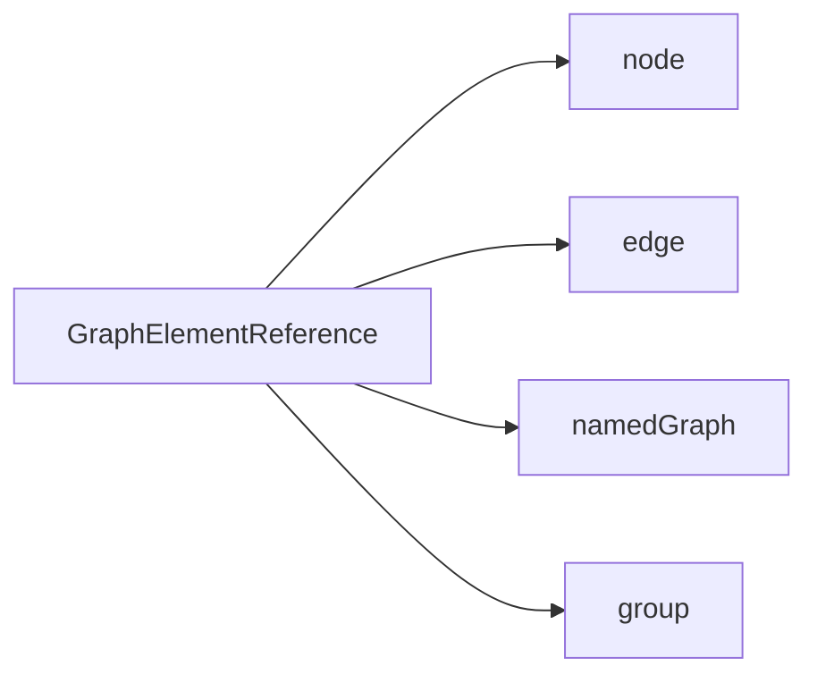
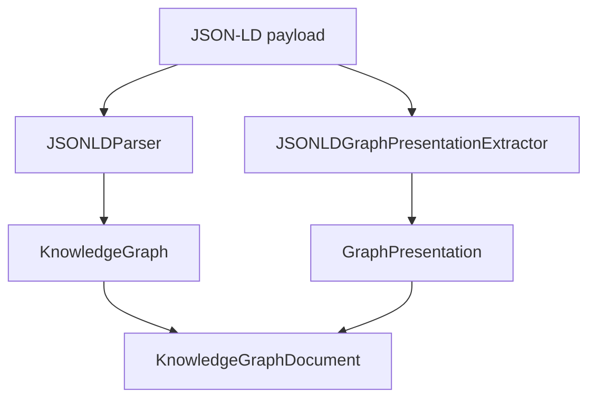
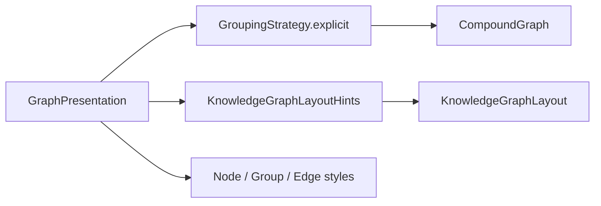

# Graph Presentation IR

この文書は `swift-knowledge-graph` における表示用中間表現
`GraphPresentation` の方針を定義する。目的は、RDF / JSON-LD / TriG などの
標準意味グラフを汚さずに、複数の GraphView / renderer / exporter が共有できる
grouping、ordering、layout intent、shape / style intent を保持することである。

---

## 1. 背景

`KnowledgeGraph` は node / edge / namespace / named graph を保持する意味グラフ
IR である。配列順は warm restart のために安定しているが、これは表示順やレイアウト
制約を意味しない。

一方、GraphView では次のような表示意図が必要になる。

| 要求 | 例 |
|---|---|
| Grouping | layer / category / named graph / user-defined group |
| Ordering | group や node を指定順に並べる |
| Arrangement | 縦積み、横積み、grid、rank alignment |
| Shape | rectangle、rounded rectangle、capsule |
| Styling | fill / stroke / text color、edge line style、opacity |
| Scope | view 全体、group 内、特定 named graph 内 |
| Priority | 必ず守る制約ではなく、layout engine への優先ヒント |

これらは RDF triple の意味ではなく、表示用メタデータである。



---

## 2. 設計原則

| 原則 | 内容 |
|---|---|
| Semantic purity | `KnowledgeGraph` の node / edge / named graph は表示都合で増やさない |
| Presentation is optional | presentation が存在しなくても graph は完全に利用可能 |
| Renderer portability | `GraphPresentation` は SwiftUI / CoreGraphics に依存しない |
| Graceful degradation | 解釈できない directive は無視できる |
| Stable references | layout directive は文字列だけではなく typed reference で対象を示す |
| Attribute-inspired | style は `Attribute` のように外部由来 metadata として扱うが、共通語彙は型付きで定義する |
| Generic shapes | shape vocabulary は一般的な図形に限定し、renderer 固有コンポーネント名を入れない |
| Soft constraints first | 初期実装は `preferred` hint として扱い、既存 layout の安全制約を優先する |
| Explicit Codable schema | associated-value enum は Swift の自動 `Codable` 形式に依存せず、`type` field を持つ明示 schema として保存する |

---

## 3. 層構造



`KnowledgeGraphDocument` は semantic graph と presentation graph を束ねる上位 IR
である。

```swift
public struct KnowledgeGraphDocument: Hashable, Sendable, Codable {
    public let graph: KnowledgeGraph
    public let presentations: [GraphPresentation]
}
```

`KnowledgeGraph` 本体へ `presentations` を直接追加しない。RDF parser の出力と
表示用 document の責務を分けるためである。

---

## 4. Core Types

### 4.1 `GraphPresentation`

```swift
public struct GraphPresentation: Hashable, Sendable, Codable, Identifiable {
    public let id: String
    public let title: String?
    public let groups: [GraphPresentationGroup]
    public let layouts: [GraphLayoutDirective]
    public let styles: [GraphStyleRule]
}
```

### 4.2 `GraphPresentationGroup`

Group は表示用の集合であり、RDF node ではない。

```swift
public struct GraphPresentationGroup: Hashable, Sendable, Codable, Identifiable {
    public let id: String
    public let title: String
    public let kind: String?
    public let members: [GraphElementReference]
    public let children: [GraphPresentationGroup]
    public let attributes: [Attribute]
}
```

`attributes` は source から来た自由形式 metadata の保持に使う。共通 renderer が解釈すべき
shape / color / edge style は `GraphStyleRule` の型付き vocabulary へ正規化する。

### 4.3 `GraphStyleRule`

Style は対象を typed reference で指し、Node / Edge / Group の一般的な見た目を表す。
これは semantic graph を変更しない。

```swift
public struct GraphStyleRule: Hashable, Sendable, Codable, Identifiable {
    public let id: String
    public let target: GraphStyleTarget
    public let style: GraphStyle
    public let priority: GraphStylePriority
    public let attributes: [Attribute]
}
```

`target` は単一要素、group、kind、rdfType などを直接指定できる。

```swift
public enum GraphStyleTarget: Hashable, Sendable, Codable {
    case node(NodeIdentifier)
    case edge(EdgeIdentifier)
    case namedGraph(String)
    case group(String)
    case kind(String)
    case rdfType(String)
    case allNodes
    case allEdges
    case allGroups
}
```

Style target は `GraphElementReference` で包まず、style が解釈できる対象を
direct case として持つ。これにより builder / renderer 側の switch が読みやすくなり、
layout 用 reference と style scope の責務を分離できる。

優先順は renderer が deterministic に解決する。

| Priority | Use |
|---|---|
| `default` | renderer default より少し強い基礎 style |
| `theme` | theme layer |
| `explicit` | source が明示した style |
| `override` | editor / user override |

### 4.4 `GraphStyle`

```swift
public struct GraphStyle: Hashable, Sendable, Codable {
    public let shape: GraphShape?
    public let fill: GraphPaint?
    public let stroke: GraphStroke?
    public let text: GraphTextStyle?
    public let edge: GraphEdgeStyle?
    public let opacity: Double?
}
```

Style は optional field の集合であり、対象に関係ない field は無視される。
例えば `edge` は Node に対して無視され、`shape` は Edge に対して無視される。

### 4.5 Shape Vocabulary

初期 shape vocabulary は一般的な Shape に限定する。

```swift
public enum GraphShape: Hashable, Sendable, Codable {
    case rectangle
    case roundedRectangle(radius: Double?)
    case capsule
    case ellipse
}
```

推奨する初期対応:

| Target | Shapes |
|---|---|
| Node | `rectangle`, `roundedRectangle`, `capsule` |
| Group | `rectangle`, `roundedRectangle` |
| Edge | shape を持たず `GraphEdgeStyle` で線形状を表す |

### 4.6 Paint / Stroke / Text

SwiftUI / CoreGraphics 非依存にするため、色は platform color ではなく serializable
value として持つ。

```swift
public enum GraphPaint: Hashable, Sendable, Codable {
    case color(GraphColor)
    case palette(String)
    case semantic(String)
}

public struct GraphColor: Hashable, Sendable, Codable {
    public let red: Double
    public let green: Double
    public let blue: Double
    public let alpha: Double
}

public struct GraphStroke: Hashable, Sendable, Codable {
    public let paint: GraphPaint?
    public let width: Double?
    public let line: GraphLineStyle?
}

public enum GraphLineStyle: Hashable, Sendable, Codable {
    case solid
    case dashed(pattern: [Double]?)
    case dotted
}

public struct GraphTextStyle: Hashable, Sendable, Codable {
    public let paint: GraphPaint?
    public let weight: String?
    public let size: Double?
}
```

`palette` と `semantic` は renderer / theme が解決する。source 側は具体 RGB と
theme token のどちらも表現できる。

### 4.7 Edge Style

Edge は線種、色、端点 marker、経路 preference を持つ。

```swift
public struct GraphEdgeStyle: Hashable, Sendable, Codable {
    public let stroke: GraphStroke?
    public let sourceMarker: GraphMarker?
    public let targetMarker: GraphMarker?
    public let route: GraphEdgeRouteStyle?
}

public enum GraphMarker: Hashable, Sendable, Codable {
    case none
    case arrow
    case circle
    case diamond
}

public enum GraphEdgeRouteStyle: Hashable, Sendable, Codable {
    case automatic
    case orthogonal
    case straight
    case curved
}
```

Renderer は対応できない route style を `automatic` として扱ってよい。

### 4.8 Attribute Vocabulary

`Attribute` は自由形式 escape hatch として残す。ただし、複数 renderer で共有したい
基本 style は以下の canonical key に正規化する。

| Attribute key | Typed destination |
|---|---|
| `kg.shape` | `GraphStyle.shape` |
| `kg.fill` | `GraphStyle.fill` |
| `kg.stroke` | `GraphStyle.stroke.paint` |
| `kg.strokeWidth` | `GraphStyle.stroke.width` |
| `kg.lineStyle` | `GraphLineStyle` |
| `kg.textColor` | `GraphTextStyle.paint` |
| `kg.edgeMarker` | `GraphEdgeStyle.targetMarker` |
| `kg.edgeRoute` | `GraphEdgeRouteStyle` |
| `kg.layout.direction` | `GraphStackArrangement.direction` |
| `kg.layout.alignment` | `GraphStackArrangement.alignment` |
| `kg.layout.spacing` | `GraphStackArrangement.spacing` |

Canonical attributes are useful for light-weight source formats and builder APIs,
but `GraphPresentation.styles` is the normalized representation that renderers should consume.
Layout attributes follow SwiftUI naming conventions where the meaning is shared:
`spacing` is the distance between arranged items, and `alignment` is the cross-axis
placement hint for stack-like arrangements. The IR keeps platform-independent
types and does not expose SwiftUI concrete types.



### 4.9 `GraphElementReference`

Layout / group membership は typed reference で対象を示す。

```swift
public enum GraphElementReference: Hashable, Sendable, Codable {
    case node(NodeIdentifier)
    case edge(EdgeIdentifier)
    case namedGraph(String)
    case group(String)
}
```



### 4.10 `GraphLayoutDirective`

Layout directive は絶対座標ではなく、配置意図を表す。

```swift
public struct GraphLayoutDirective: Hashable, Sendable, Codable, Identifiable {
    public let id: String
    public let scope: GraphElementReference?
    public let items: [GraphElementReference]
    public let arrangement: GraphArrangement
    public let priority: GraphLayoutPriority
}
```

初期 vocabulary:

| Arrangement | 意味 |
|---|---|
| `stack` | item を指定 direction に沿って順番に配置する |
| `order` | layout engine の候補順だけを指定する |
| `rank` | item を同一 rank / band に揃える |
| `grid` | 行列状に配置する |
| `pin` | item の位置を固定または優先する |
| `align` | item の辺または中心を揃える |

`stack` は `axis` を保存しない。`axis` は `GraphStackDirection` から導出する。
これにより `horizontal + topToBottom` のような矛盾した状態を API 上作れない。

```swift
public struct GraphStackArrangement: Hashable, Sendable, Codable {
    public let direction: GraphStackDirection
    public let alignment: GraphStackAlignment
    public let spacing: Double?

    public var axis: GraphAxis { direction.axis }
}
```

初期実装では `stack` と `order` を優先する。

---

## 5. JSON-LD Integration

JSON-LD parser は W3C JSON-LD to RDF algorithm に集中する。非標準の top-level
`view` metadata は parser 本体では扱わない。

`view.groups` / `view.layouts` / `view.styles` は別 extractor が読み取り、
`GraphPresentation` を生成する。`view` が無い、または有効な presentation metadata が
無い場合は `nil` を返す。JSON が壊れている、または top-level が object ではない場合は
`JSONLDGraphPresentationExtractionError` を throw する。



この分離により、W3C test suite との互換性を保ちながら、SwiftArtifact や他の
GraphView が同じ presentation metadata を共有できる。

JSON-LD shape / style example:

```json
{
  "view": {
    "groups": [
      {
        "id": "group:domestic-dc",
        "kind": "stage",
        "title": "Domestic DC",
        "members": ["ex:chiba-dc", "ex:okayama-dc"]
      }
    ],
    "styles": [
      {
        "id": "style:domestic-dc",
        "target": { "type": "group", "id": "group:domestic-dc" },
        "shape": "roundedRectangle",
        "fill": "#EAF7F3",
        "stroke": "#2CB67D",
        "strokeWidth": 1.5
      },
      {
        "id": "style:air-route",
        "target": { "type": "kind", "id": "airRoute" },
        "lineStyle": "dashed",
        "stroke": "#7C5CFF",
        "edgeMarker": "arrow"
      }
    ]
  }
}
```

---

## 6. Migration Plan

### Phase 1: Move JSON-LD view group extraction

現在 `swift-artifact` にある `JSONLDViewGroupExtractor` 相当の責務を
`swift-knowledge-graph` に移す。

移設後の責務:

| Component | Responsibility |
|---|---|
| `JSONLDParser` | W3C JSON-LD to RDF |
| `JSONLDGraphPresentationExtractor` | top-level `view` metadata から groups / styles / layouts を抽出し `GraphPresentation` を生成 |
| `swift-artifact` | `GraphPresentation` を `GroupingStrategy` / layout hints に変換して描画 |

`swift-artifact` は JSON-LD の raw payload を直接解釈せず、
`swift-knowledge-graph` が提供する typed presentation IR を消費する形へ移行する。

### Phase 2: Add document-level API

`KnowledgeGraphDocument` を追加し、JSON-LD payload から
`KnowledgeGraph + GraphPresentation` を得る API を用意する。

### Phase 3: Consume groups from SwiftArtifact

`swift-artifact` の `GroupingStrategy.explicit` 生成を
`GraphPresentation.groups` ベースに置き換える。

### Phase 4: Consume layout directives

`GraphStyleRule` を `swift-artifact` の Node / Group / Edge rendering style に反映する。

### Phase 5: Consume layout directives

`GraphLayoutDirective.stack` / `order` を `KnowledgeGraphLayout` の初期配置、
group packing order、rank-preserving compaction に順次反映する。

### Phase 6: Extend layout vocabulary

必要に応じて `rank` / `grid` / `pin` / `align` を追加する。

---

## 7. Non-Goals

| Non-goal | Reason |
|---|---|
| RDF triple として layout を表現する | 表示都合を semantic graph に混ぜないため |
| Parser 本体で `view` を RDF 化する | W3C JSON-LD to RDF の責務から外れるため |
| 最初から hard constraints を実装する | 既存 edge routing / overlap safety を壊しやすいため |
| SwiftUI / CoreGraphics 型を IR に入れる | 複数 renderer で共有できなくなるため |
| renderer 固有 component 名を style vocabulary に入れる | GraphPresentation の移植性が落ちるため |

---

## 8. SwiftArtifact Consumption

`swift-artifact` は `GraphPresentation` を renderer-specific な構造へ変換する。



変換規則:

| Source | SwiftArtifact target |
|---|---|
| `GraphPresentationGroup` | `GroupingStrategy.ExplicitGroup` |
| `GraphStyleRule` for group | `GroupStyle` / group renderer style |
| `GraphStyleRule` for node | card shape / fill / stroke / text style |
| `GraphStyleRule` for edge | edge stroke / line style / marker |
| `GraphLayoutDirective.stack` | initial placement / packing order hint |
| `GraphLayoutDirective.order` | candidate order hint |
| unknown directive | ignored |

Layout engine は presentation hint よりも、node overlap、edge route validity、
group containment、canvas normalization を優先する。
